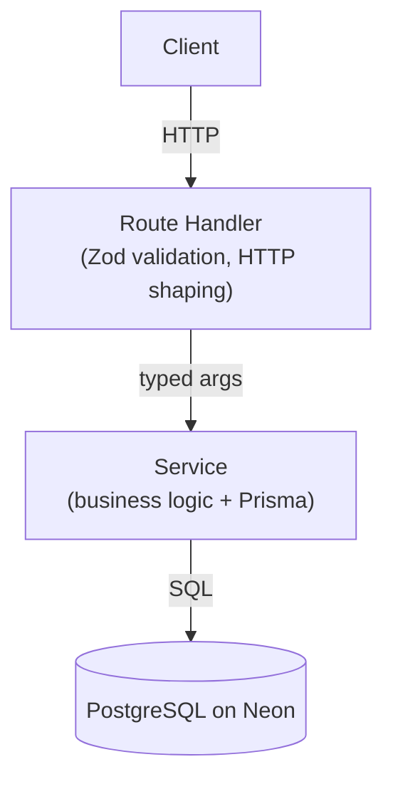

# Log A Send

A mobile-first bouldering tracker. Log a send, pick a grade, attach a photo or video if you have one. Session history is there at the end of the day.

**Try it here: [log-a-send.vercel.app](https://log-a-send.vercel.app)**

---

## Architecture

Two layers: route handlers own HTTP and validation, services own business logic and Prisma. No repo tier — for one entity it's ceremony, and it's one file to add if that changes.



The non-obvious decision is idempotency. Every write computes a key (`userId#gymId#grade#minute`) backed by a DB unique constraint. If the client retries after a timeout it gets the original record back — no client-side dedup, no cache to invalidate.

Frontend state is TanStack Query. Sends use an optimistic insert that rolls back the snapshot on error. No global store.

Auth is a `localStorage` UUID — intentional placeholder. Swapping in Clerk or NextAuth touches `src/user.ts` and adds one guard to each handler; the service layer is unchanged.

---

## Stack

Next.js 15 (App Router), React 19, Tailwind v4, TanStack Query v5, Framer Motion. PostgreSQL on Neon via Prisma. Vercel Blob for media. Vitest for tests. Deployed on Vercel.

---

## Running locally

```sh
npm install
cp .env.example .env  # fill in DATABASE_URL; BLOB_READ_WRITE_TOKEN is optional
npm run db:push
npm run dev
```

No Vercel Blob account needed — the upload endpoint returns `{ photoUrl: null }` when the token isn't set.

---

## Tests

```sh
npm test
```

Vitest covers the service layer, all route handlers (happy path + validation errors), gym search, and the `clampAttempts` helper. Handler tests mock the service — unit tests, not integration. A real DB-backed suite is the obvious next step.

CI runs `typecheck → test` on every push. Vercel deploys from `main` independently.

---

## Known limitations

- **Auth is a placeholder.** `localStorage` UUID — fine for a personal tracker, not for anything multi-user.
- **No per-user upload quotas.** MIME whitelist and 100 MB cap exist; rate limiting doesn't.
- **No correlation IDs** in the logger, so tracing a single request across log lines takes manual effort.
- **No integration tests** against a real database.
- **Single photo per send**, no pagination on history.
