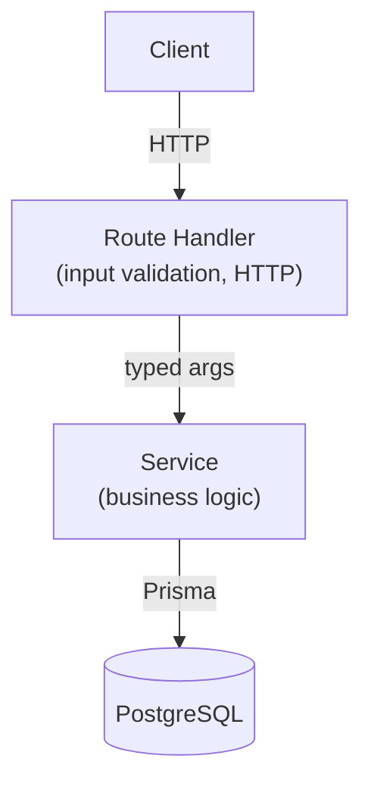

# Log A Send

A mobile-first web app for boulderers to track their sends — log a problem, grade it in V Scale or Fontainebleau, record how many attempts it took, and optionally attach a photo or video. All sends are persisted in real time so you can review your full session at the end of a climbing day.

---

## Stack

| Layer | Technology |
|---|---|
| Framework | Next.js 15 (App Router) |
| Language | TypeScript (strict) |
| Database | PostgreSQL via Prisma ORM, hosted on Neon |
| Media storage | Vercel Blob |
| Frontend state | TanStack Query v5 |
| Animations | Framer Motion |
| Styling | Tailwind CSS v4 |
| Testing | Vitest |
| Deploy | Vercel (CI via GitHub Actions) |

---

## Architecture

### Handler → Service → Repository

The API layer follows a strict three-tier separation. Next.js route handlers (`app/api/**/route.ts`) own HTTP concerns: parse the request, validate input with Zod, call a service, return a response. The service layer (`src/services/sendService.ts`) owns all business logic and has no knowledge of HTTP or the database driver. The database is accessed exclusively through Prisma. This separation means business logic is unit-testable without any HTTP or database infrastructure.



### Why PostgreSQL + Prisma instead of a simpler store?

The primary driver was idempotency. Every send is written with a computed `idempotencyKey` (`userId#gymId#grade#minute`) backed by a Postgres unique constraint. If the client retries a POST after a timeout, the server catches the `P2002` constraint violation and returns the existing record — no duplicates, no client-side deduplication logic needed. Prisma adds a compound index on `(userId, sentAt DESC)` for efficient per-user session queries, and schema migrations keep the data model explicit and version-controlled.

### Why TanStack Query for state?

Server state (the sends list) lives entirely in the TanStack Query cache: fetching, caching, and invalidation are all handled there. When a send is submitted, the mutation performs an **optimistic update** — the new entry appears instantly in the Today tab while the request is in-flight, and rolls back cleanly if the server returns an error. There is no global store to maintain; the view stays in sync automatically once the mutation settles.

### Auth placeholder

User identity is currently a UUID generated and persisted in `localStorage` (`src/user.ts`). This is intentional and explicitly marked as a placeholder. Adding an auth provider (e.g. Clerk or NextAuth) would replace this single import site without touching any service or handler code.

---

## Getting Started

```sh
# Install dependencies
npm install

# Set up environment variables
cp .env.example .env
# Fill in DATABASE_URL and BLOB_READ_WRITE_TOKEN

# Push the schema to your database
npm run db:push

# Start the dev server
npm run dev
```

### Environment variables

| Variable | Description |
|---|---|
| `DATABASE_URL` | PostgreSQL connection string (Neon or local) |
| `BLOB_READ_WRITE_TOKEN` | Vercel Blob token for photo/video uploads |

---

## Tests

```sh
npm test
```

Vitest unit tests cover the service layer, all API route handlers (happy path + validation errors), and the gym search utilities. The CI pipeline (`test → typecheck → deploy`) enforces this on every push.
